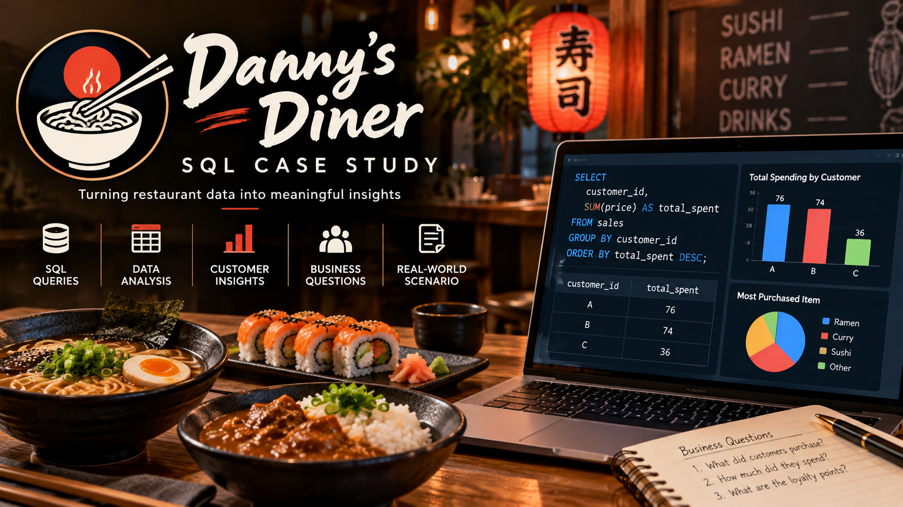

# Danny's Diner SQL Case Study
(a_wide_cinematic_professional_data_analytics_the.png)
## Project Overview

This project analyzes customer purchasing behavior for Danny's Diner using SQL.

The analysis focuses on customer spending, visit frequency, favorite menu items, membership behavior, and loyalty points.

## Dataset

The project contains three tables:

- `sales` — customer purchases and order dates
- `menu` — menu items and prices
- `members` — customer membership information

## Tools Used

- MySQL
- MySQL Workbench
- SQL

## Business Questions

1. How much did each customer spend?
2. How many days did each customer visit?
3. What was each customer's first purchased item?
4. What is the most purchased item overall?
5. What is the most popular item for each customer?
6. What did customers purchase after becoming members?
7. What did customers purchase just before becoming members?
8. How much did members spend before joining?
9. How many loyalty points did each customer earn?
10. How many points did members earn during their first week?
## Key Findings

| Analysis | Result |
|---|---|
| Total spending | A: $76, B: $74, C: $36 |
| Visit frequency | A: 4 days, B: 6 days, C: 2 days |
| First item purchased | A: Sushi, B: Curry, C: Ramen |
| Most purchased item overall | Ramen — 8 purchases |
| Most popular item by customer | A: Ramen (3), B: Curry (2), C: Ramen (3) |
| First purchase after membership | A: Curry, B: Sushi |
| Pre-membership spending | A: $25, B: $40 |
| Loyalty points | A: 860, B: 940, C: 360 |
| January points with first-week bonus | A: 1,370, B: 820 |

## Key Skills Demonstrated

- SELECT statements
- JOINs
- GROUP BY
- Aggregate functions
- Subqueries
- CASE statements
- Window functions
- Date filtering
- Customer behavior analysis
